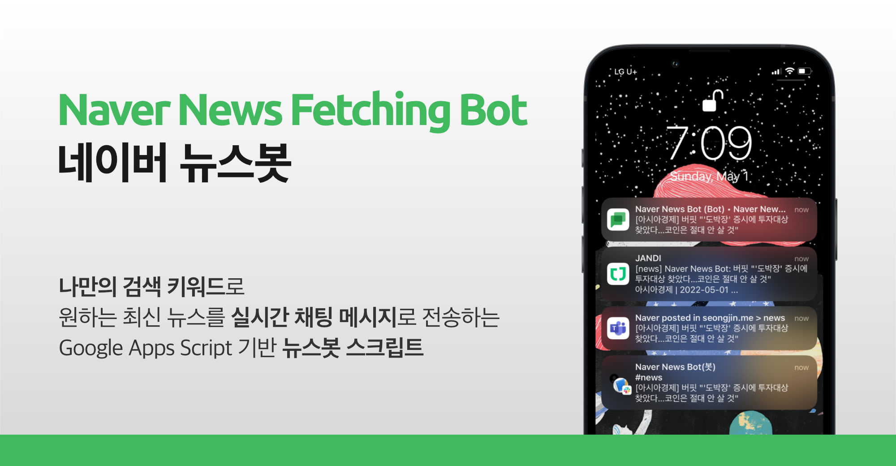
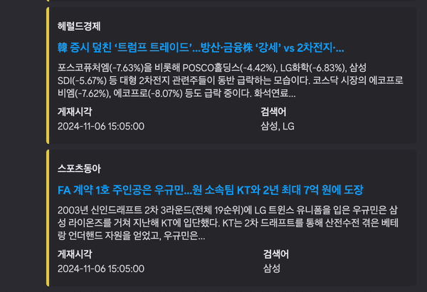

# Naver News Fetching Bot | 네이버 뉴스봇

관심 있는 키워드의 뉴스를 메신저에서 실시간으로 받아보세요!

네이버 뉴스봇은 여러분이 지정한 **키워드가 포함된 최신 뉴스를 자동으로 수집하여 메신저로 전달**해주는 Google Apps Script 기반 오픈소스 스크립트입니다. **슬랙(Slack), 디스코드(Discord), 잔디(Jandi), 구글챗(Google Chat)** 등 주요 업무용 메신저를 모두 지원합니다. 네이버 뉴스봇과 함께, 복잡한 서버 구축 없이 뉴스 모니터링 업무를 자동화 해보세요.

### 주요 기능

- **실시간 뉴스 모니터링**: 최대 5개의 키워드를 골라 꼭 필요한 뉴스만 받아보세요.
- **다양한 메신저 지원**: 팀에서 사용 중인 메신저로 뉴스를 전송하실 수 있습니다.
- **뉴스 아카이빙**: 전송된 뉴스들을 Google SpreadSheet 문서에 자동 저장하여 히스토리를 관리하실 수 있습니다. (선택 기능)

### 이용 화면 (PC, 디스코드 화면)

## 업데이트 내역

### Ver 3.0.2 (2025-03-07)

- Google Chat에서 알림 메시지 형식이 아닌 뉴스 항목만 전송되지 않던 문제 수정

### Ver 3.0.1 (2024-12-05)

- 최초 설치시 일부 샘플 뉴스의 미전송 문제 수정

### Ver 3.0.0 (2024-11-08)

- **다중 키워드 검색 지원 (최대 5개)**
- **Discord 지원 추가**
- **최초 설치 시 매분 실행되는 트리거 자동 생성**

보다 자세한 업데이트 내용은 [CHANGELOG.md](./docs/CHANGELOG.md)에서 확인하실 수 있습니다.

## 설치 방법

아래 문서를 참고하여 단계 별로 따라해주세요.
만약 설치 과정에 어려움이 있으시다면 본 저장소의 [Issue](https://github.com/seongjinme/naver-news-fetching-bot/issues) 또는 [메일](mailto:mail@seongjin.me)을 통해 문의를 남겨주세요.

- [설치 방법 보러가기](./docs/INSTALLATION.md)

## 라이센스 정책

Naver News Fetching Bot은 MIT License를 따릅니다.
