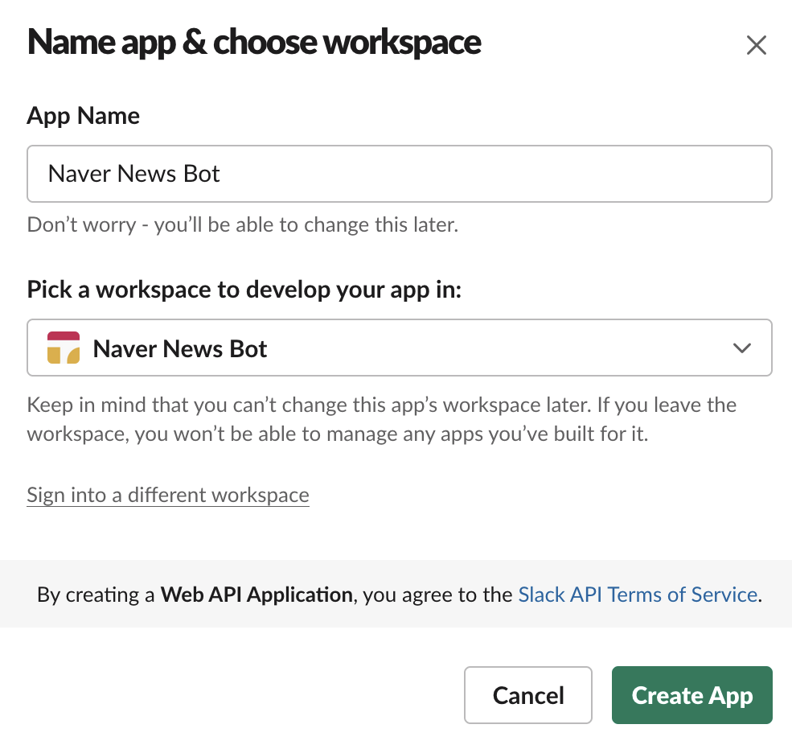
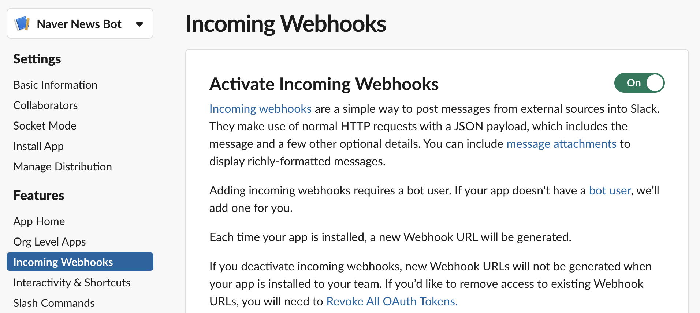
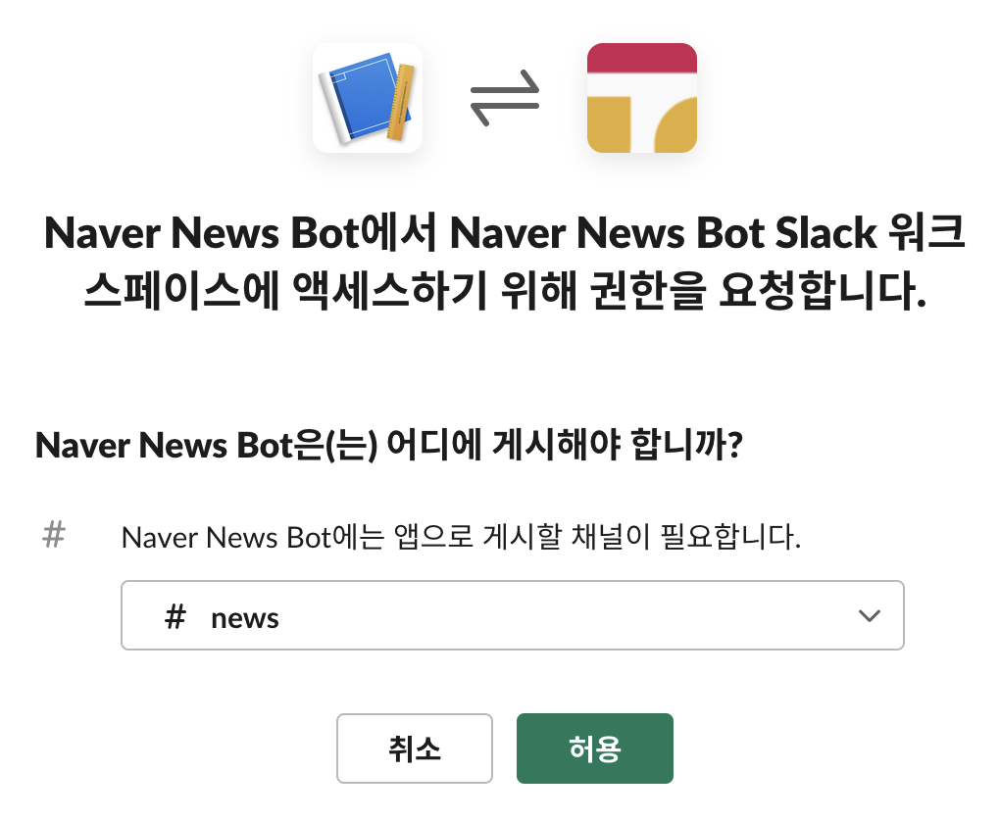
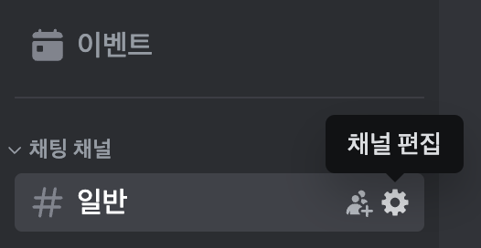
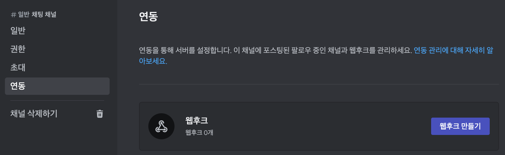
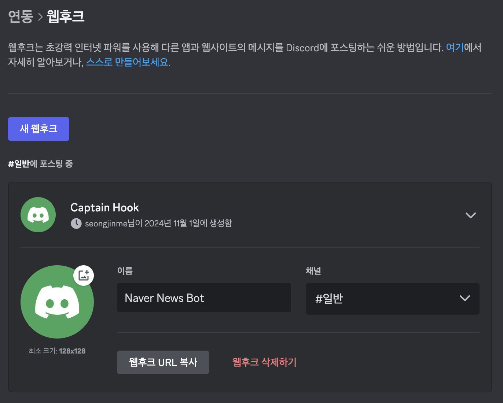
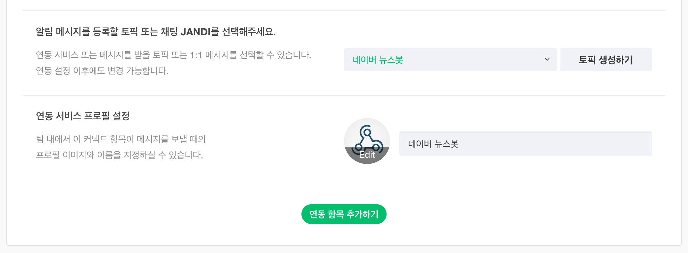
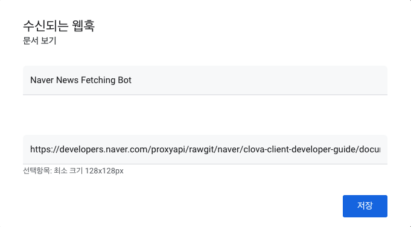
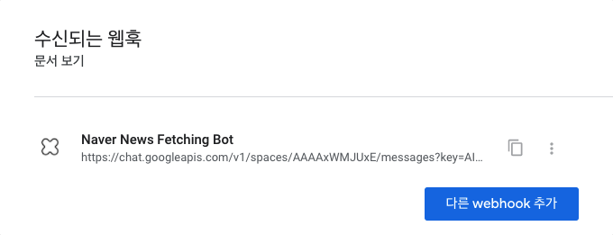

# 메신저별 Webhook 생성 방법

## 슬랙(Slack)

[Slack API 공식 문서 - "Getting started with incoming webhooks"](https://api.slack.com/messaging/webhooks#getting_started) 내용을 참고하여 진행해주세요.

1. Slack에 로그인하신 상태에서 [새 Slack 앱을 생성](https://api.slack.com/apps?new_app=1)합니다. "Create an app" 팝업에서 `From scratch`를 선택하신 뒤, 원하시는 봇 이름과 뉴스를 전송할 워크스페이스를 선택하고 `Create App` 버튼을 누릅니다.

2. 앱 생성 완료 후 나타나는 Basic Information 화면에서 `Add features and functionality`를 누르면 나타나는 `Incoming Webhooks`를 선택한 뒤 `Activate Incoming Webhooks` 토글을 켜서 `On`으로 만듭니다.

3. 같은 화면 하단의 `Add New Webhook to Workspace` 버튼을 누른 뒤, 뉴스를 전송할 Slack 채널 또는 사용자를 지정하고 `허용(Allow)` 버튼을 누릅니다.

4. 다시 돌아온 화면의 하단에 표시된 `Webhook URL`을 복사하여 보관해주세요. 추후 뉴스봇 설치 과정 중 "뉴스봇 실행에 필요한 설정값 입력하기" 단계에서 이 URL을 `config.gs` 안에 입력해 주시면 됩니다.

---

## 디스코드(Discord)

1. PC로 사용자님의 디스코드 서버에 로그인하신 상태에서, 좌측 최상단의 "채팅 채널" 목록 가운데 뉴스를 전송할 채널 오른편의 "채널 편집" 버튼(톱니바퀴 아이콘)을 클릭합니다.

2. "채널 편집" 화면 좌측의 메뉴에서 "연동"을 클릭한 후, "웹후크"를 선택하여 "웹후크 만들기" 또는 "새 웹후크" 버튼을 클릭합니다.

3. 새 웹후크가 즉시 생성됩니다.

4. 이 웹후크를 선택하셔서 이름을 설정하신 뒤, "웹후크 URL 복사"를 눌러 복사된 URL을 보관해주세요. 추후 뉴스봇 설치 과정 중 "뉴스봇 실행에 필요한 설정값 입력하기" 단계에서 이 URL을 `config.gs` 안에 입력해 주시면 됩니다.

---

## 잔디(Jandi)

1. PC로 잔디에 로그인하신 상태에서 우측 최상단 버튼을 누르고 `잔디 커넥트`로 이동합니다.

2. 연동 서비스 목록 가운데 `Webhook 수신 (Incoming Webhook)`의 `연동 항목 추가하기`를 누릅니다.

3. 뉴스를 받아보실 토픽이나 1:1 메시지를 선택하시고, 뉴스봇의 이름과 프로필 사진을 정하신 뒤 `연동 항목 추가하기`를 누릅니다.

4. 생성된 `Webhook URL`을 복사하여 보관해주세요. 추후 뉴스봇 설치 과정 중 "뉴스봇 실행에 필요한 설정값 입력하기" 단계에서 이 URL을 `config.gs` 안에 입력해 주시면 됩니다.

---

## 구글챗(Google Chat)

구글챗(Google Chat)의 경우 **구글 워크스페이스(Google Workspace)에 유료 가입된 조직의 구성원**만 Webhook 생성이 가능합니다. 이에 대한 자세한 설명은 구글 측에서 제공하는 [Google Chat 계정 유형의 차이점 알아보기](https://support.google.com/chat/answer/9291345?hl=ko)와 [사용자가 봇을 설치하도록 허용하기](https://support.google.com/a/answer/7651360?hl=ko) 문서를 참고해주시기 바랍니다.

1. 봇을 추가할 Google Chat 대화방(Space)에 PC로 접속한 뒤 아래 사진과 같이 “웹훅 보기”를 선택합니다.

2. 새로 추가할 Webhook의 이름과 프로필 사진 URL(선택사항)을 입력합니다.

3. 새로 생성된 Webhook의 URL을 복사해주세요. 추후 뉴스봇 설치 과정 중 "뉴스봇 실행에 필요한 설정값 입력하기" 단계에서 이 URL을 `config.gs` 안에 입력해 주시면 됩니다.

