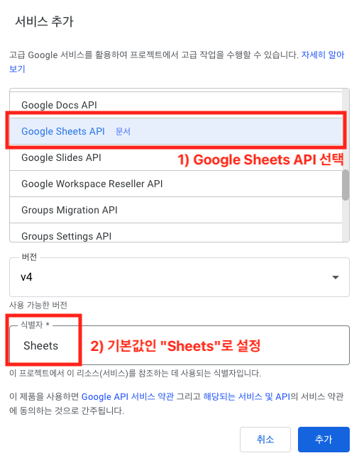
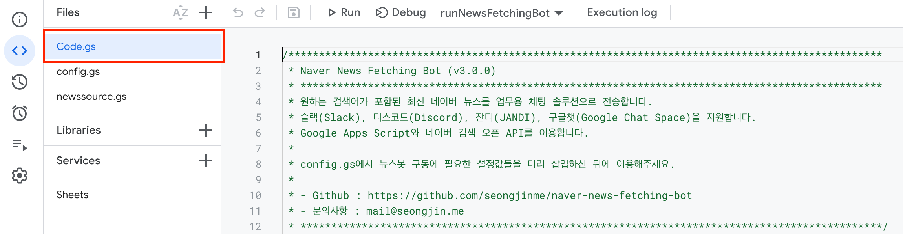
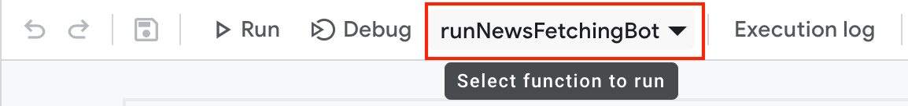
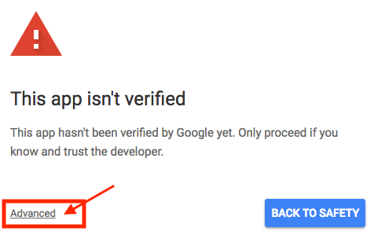

# Naver News Fetching Bot 설치 방법

네이버 뉴스봇은 사용자 여러분의 구글 계정으로 이용 가능한 Google Apps Script 환경에 코드를 복사하여 직접 실행하는 구조로 작동됩니다. 아래의 절차를 차례대로 잘 진행해주세요.

1. [뉴스를 받을 메신저에 Webhook 생성하기](#1-뉴스를-받을-메신저에-webhook-생성하기)
2. [네이버 검색 API용 Client ID, Secret 생성하기](#2-네이버-검색-api용-client-id-secret-생성하기)
3. [Google Apps Script 환경에 새 프로젝트를 만들고 코드를 붙여넣기](#3-google-apps-script-환경에-새-프로젝트를-만들고-코드를-붙여넣기)
4. [뉴스봇 실행에 필요한 설정값 입력하기](#4-뉴스봇-실행에-필요한-설정값-입력하기)
5. [뉴스봇 최초 실행 및 권한 부여하기](#5-뉴스봇-최초-실행-및-권한-부여하기)

---

## 1. 뉴스를 받을 메신저에 Webhook 생성하기

Webhook은 새로 들어온 데이터에 대해 실시간으로 알림을 받을 수 있게 하는 기능입니다. 네이버 뉴스봇은 Webhook을 이용하여 사용하시는 메신저의 특정 채팅방에 뉴스를 전송해 드리게 됩니다.

뉴스를 받아보시려면, 먼저 메신저 환경에서 Incoming Webhook을 생성하셔야 합니다. 이용하시는 메신저 별로 상세 방법을 아래와 같이 안내해 드립니다.

### 지원 메신저별 Webhook 생성 방법

- [슬랙(Slack)](./GUIDE_WEBHOOK.md#%EC%8A%AC%EB%9E%99slack)
- [디스코드(Discord)](./GUIDE_WEBHOOK.md#디스코드discord)
- [잔디(JANDI)](./GUIDE_WEBHOOK.md#%EC%9E%94%EB%94%94jandi)
- [구글챗(Google Chat)](./GUIDE_WEBHOOK.md#%EA%B5%AC%EA%B8%80%EC%B1%97google-chat)

## 2. 네이버 검색 API용 Client ID, Secret 생성하기

네이버 뉴스봇은 키워드에 대한 뉴스 검색 결과를 네이버 검색 API로부터 받아오도록 설계되어 있습니다. 이것이 가능하도록 하려면, API 사용에 필요한 ID와 Client값을 새로 만들어 주셔야 합니다. 아래 절차를 따라주세요.

1. [네이버의 공식 가이드 문서](https://developers.naver.com/docs/common/openapiguide/appregister.md)를 참고하시면서, [이 페이지](https://developers.naver.com/apps/#/wizard/register)에서 애플리케이션 등록 절차를 진행합니다.
2. [애플리케이션 등록 세부 정보 입력 단계](https://developers.naver.com/docs/common/openapiguide/appregister.md#%EC%95%A0%ED%94%8C%EB%A6%AC%EC%BC%80%EC%9D%B4%EC%85%98-%EB%93%B1%EB%A1%9D-%EC%84%B8%EB%B6%80-%EC%A0%95%EB%B3%B4)에서 다음 안내에 따라 입력합니다.

- `애플리케이션 이름` : 사용하실 이름을 입력합니다. (예: "네이버 뉴스봇")
- `사용 API` : `검색`을 선택합니다.
- `비로그인 오픈 API 서비스 환경` : `WEB 설정`을 선택한 뒤 "웹 서비스 URL" 항목에 `https://naver.com`을 입력합니다.

3. 애플리케이션 등록이 완료되면, [해당 애플리케이션 정보 화면](https://developers.naver.com/docs/common/openapiguide/appregister.md#%EC%95%A0%ED%94%8C%EB%A6%AC%EC%BC%80%EC%9D%B4%EC%85%98-%EB%93%B1%EB%A1%9D-%ED%99%95%EC%9D%B8)에 Client ID와 Secret 값이 나타납니다. 이 값들을 잘 보관해주세요.

## 3. Google Apps Script 환경에 새 프로젝트를 만들고 코드를 붙여넣기

1. 구글 계정에 로그인하신 뒤, [Google Apps Script](https://script.google.com) 환경에 접속하셔서 왼쪽 상단의 "새 프로젝트(New project)" 버튼을 눌러 새 프로젝트를 생성해 주세요.
2. 프로젝트 화면 왼쪽 상단의 파일 목록에서 `Code.gs`를 클릭하신 후, 본 저장소의 `/dist/` 경로에 있는 [Code.gs](../dist/Code.gs) 파일 내용을 복사하여 그대로 붙여넣습니다.
3. 프로젝트 화면 왼쪽 상단의 파일 목록에서 "+" -> "Script" 버튼을 차례로 누르시면 새 스크립트 파일이 추가됩니다. 2개의 파일(`config.gs`, `source.gs`)을 추가해 주세요.
4. 저장소의 `/dist/` 경로에 있는 나머지 파일들의 내용을 위에서 추가한 파일에 각각 복사하여 붙여넣습니다.

- `config.gs`에는 [config.gs](../dist/config.gs)의 내용을,
- `source.gs`에는 [source.gs](../dist/source.gs)의 내용을 넣어주세요.

### (선택사항) 뉴스 백업용 구글 시트 사용을 위한 API 추가하기

원하시는 구글 시트 문서로 뉴스를 백업하시려면 아래 절차를 추가로 진행해 주셔야 합니다.

5. 프로젝트 화면의 왼쪽 메뉴에서 "서비스(Services)" 우측의 "+" 버튼을 누릅니다.
6. API 추가 팝업 화면에서 `Google Sheets API`를 찾아 선택 후 추가합니다. 이때 식별자 이름은 기본값인 `Sheets`를 유지합니다.

## 4. 뉴스봇 실행에 필요한 설정값 입력하기

뉴스봇 실행에 필요한 설정값은 [`config.gs`](../dist/config.gs) 파일 내용의 상단에서 항목 별로 확인하실 수 있습니다.

- 1번 단계에서 생성하신 메신저용 Webhook 주소는 `config.gs`의 "뉴스 항목을 전송할 채팅 서비스별 웹훅 주소" 항목에 입력해 주세요.
- 2번 단계에서 생성하신 네이버 검색 오픈 API의 Client ID와 Secret 값은 `config.gs`의 "네이버 검색 오픈 API의 Client ID와 Secret 값" 항목에 입력해 주세요.

### 유의사항

- `DEBUG` 옵션은 뉴스봇 실행 중 에러 확인이 꼭 필요할 때에만 `true`로 바꿔주세요.
  - 이 옵션이 켜진 경우, 새로 받아온 뉴스가 전송되지 않고 Google Apps Script 실행 환경에서 로그로만 실행 결과를 기록하게 됩니다.
- 아래의 두 가지 항목 중 최소 하나 이상은 `true`로 설정되어 있어야 합니다.
  1. 뉴스 항목을 전송할 채팅 서비스별 웹훅 주소(`WEBHOOK`)의 작동 여부(`IS_ENABLED`)
  2. 뉴스 항목을 저장할 구글 시트 문서 경로(`ARCHIVING`)의 작동 여부(`IS_ENABLED`)

## 5. 뉴스봇 최초 실행 및 권한 부여하기

뉴스봇을 처음 실행하면 **메신저 및 구글 시트와의 연결을 위한 인증 팝업**이 뜨게 됩니다. 아래 순서에 맞춰 권한 허용을 진행해 주세요.

1. 위의 3~4번 단계를 마치신 후, 프로젝트 화면의 좌측 "파일(Files)"에서 `Code.gs`를 선택해 주세요.
   

2. `Code.gs` 파일이 선택된 상태로, 편집기 화면 상단에서 아래 사진과 같은 영역을 확인 후, 함수명을 `runNewsFetchingBot`으로 선택 후 "실행"을 클릭합니다.
   

3. 아래와 같이 권한 인증 팝업이 뜹니다. "권한 검토"를 누릅니다.
   

4. 메신저, Google SpreadSheets 관련 액세스 허용 팝업이 뜹니다. "허용"을 누릅니다.
   

5. 슬랙(Slack) 등 Google 외부의 서비스와 처음 연동할 때엔 "인증되지 않은 앱" 관련 경고 팝업이 뜨기도 합니다. 이때엔 팝업 왼쪽 하단의 `Advanced`를 누른 뒤, 화면 하단에 작게 쓰여진 `Go to [앱 URL] (Unsafe)` 링크를 눌러주시면 됩니다.
   

6. 연결하신 메신저 앱으로 `[Naver News Fetching Bot 설치 완료]` 메시지를 수신하셨다면, 정상적으로 설치가 완료된 것입니다.
